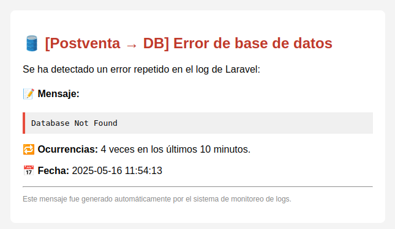

# EchoLog

**EchoLog** es un paquete para Laravel que monitorea el archivo de logs de tu aplicación y envía alertas cuando detecta errores repetitivos. Es ideal para mantener un seguimiento proactivo de fallos en producción mediante notificaciones por Discord y correo electrónico.

---

## 🚀 Características

- Monitorea el archivo de log de Laravel (`storage/logs/laravel-*.log`)
- Detecta errores repetidos en un intervalo de tiempo configurable
- Clasifica errores comunes (DB, red, permisos, correo, etc.)
- Notifica por:
  - ✅ Discord Webhook (con menciones personalizadas)
  - ✅ Correo electrónico (HTML)
- Evita notificaciones duplicadas mediante sistema de caché
- Limpieza automática del archivo de caché
- Totalmente configurable desde `config/echo-log.php`

## 🗃️ Requisitos

- Laravel 10.x o superior
- PHP 8.1 o superior

---

---

## 📦 Instalación

```bash
composer require ecomac/echo-log
```

Publica la configuración:

```bash
php artisan vendor:publish --tag=echo-log-config
```

---

## ⚙️ Configuración

Edita `config/echo-log.php` con tus parámetros:

```php
return [
    'app_name' => env('APP_NAME', 'Laravel'),
    'app_url' => env('APP_URL', 'http://localhost'),

    'scan_window_minutes' => 10,
    'cooldown_minutes' => 30,

    'email_recipients' => [
        'admin@example.com',
    ],

    'services' => [
        'discord' => [
            'webhook_url' => env('DISCORD_WEBHOOK'),
            'mention_user_ids' => ['1234567890'],
            'app_name' => env('APP_NAME', 'Laravel'),
        ],
    ],
];
```

---

## 🧪 Uso

Ejecuta el comando para analizar el log y enviar notificaciones si se detectan errores repetidos:

```bash
php artisan ecomac:monitor-log-error
```

Te recomendamos programar este comando en el scheduler (`app/Console/Kernel.php`):

```php
$schedule->command('ecomac:monitor-log-error')->everyFiveMinutes();
```

---

## 🧠 Categorización de errores

Los errores se agrupan por tipo para enviar notificaciones más claras:

| Categoría     | Ejemplo de errores                       |
|---------------|------------------------------------------|
| 📧 Mail        | smtp, mail, connection refused           |
| 🛢️ DB         | sql, pdo, database                       |
| 🔐 Auth       | unauthorized, unauthenticated, token     |
| 📁 FS         | file, filesystem, permission             |
| 🧠 Cache      | redis, cache                             |
| 🌐 Network    | curl, timeout, http, request             |
| ❗ Unknown     | Cualquier otro error                     |

---

## 💬 Notificaciones

- **Discord**: Notificaciones con formato embebido, menciones y colores.
- **Correo**: Notificaciones con un diseño HTML básico.

---

## 📸 Vistas previas

### Notificación en Discord


### Correo electrónico


## 🧑‍💻 Contribuciones

¡Las contribuciones son bienvenidas! Puedes abrir issues, enviar pull requests o sugerir mejoras en [GitHub](https://github.com/ecomac/echo-log).

---

## 📜 Licencia

MIT © [Ecomac]
