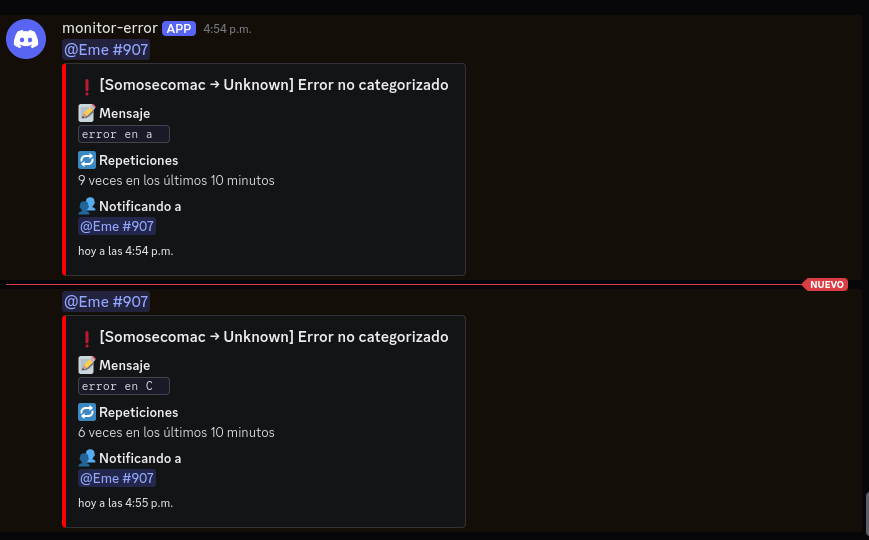

# EchoLog

**EchoLog** es un paquete para Laravel que monitorea el archivo de logs de tu aplicación y envía alertas cuando detecta errores repetitivos o críticos. Es ideal para mantener un seguimiento proactivo de fallos en producción mediante notificaciones por Discord y correo electrónico.

---

## 🚀 Características

- Monitorea el archivo de log de Laravel diario (`storage/logs/laravel-*.log`)
- Detecta errores repetidos o críticos en un intervalo de tiempo configurable
- Clasifica errores comunes (DB, red, permisos, correo, etc.)
- Soporte para niveles de severidad: `emergency`, `alert`, `critical`, `error`
- Notifica por:
  - ✅ Discord Webhook (con menciones personalizadas)
  - ✅ Correo electrónico
- Envío de correos usando **conexiones personalizadas** (además de la configuración por defecto)
- Evita notificaciones duplicadas mediante sistema de caché
- Limpieza automática del archivo de caché
- Totalmente configurable desde `config/echo-log.php`

## 🗃️ Requisitos

- Laravel 10.x o superior
- PHP 8.1 o superior

---

## 📦 Instalación

```bash
composer require ecomac/echo-log
```

## Publica el archivo de configuración

```bash
php artisan vendor:publish --tag=echo-log-config
```

##  🧪 Uso

Ejecuta el comando para analizar el log y enviar notificaciones si se detectan errores repetidos o críticos:

```bash
php artisan ecomac:monitor-log-error
```
Te recomendamos programar este comando en el scheduler `app/Console/Kernel.php`

```php
$schedule->command('ecomac:monitor-log-error')->everyFiveMinutes();
```

## 🧠 Categorización de errores

Los errores se agrupan por tipo para enviar notificaciones más claras:

| Categoría     | Ejemplo de errores                          |
|---------------|---------------------------------------------|
| 📧 Mail       | smtp, mail, connection refused, sendmail    |
| 🛢️ DB         | sql, pdo, database, mysql, deadlock         |
| 🔐 Auth       | unauthorized, unauthenticated, token         |
| 📁 FS         | file, permission, not writable               |
| 🧠 Cache      | redis, cache, memcached                      |
| 🌐 Network    | curl, timeout, dns, http, ssl                |
| 🧩 App        | exception, class not found, runtime error    |

## 📸 Vistas previas

### Notificación en Discord


### Correo electrónico


## 🧑‍💻 Contribuciones

¡Las contribuciones son bienvenidas! Puedes abrir issues, enviar pull requests o sugerir mejoras en [GitHub](https://github.com/ecomac/echo-log).

---

## 📜 Licencia

MIT © [Ecomac]
